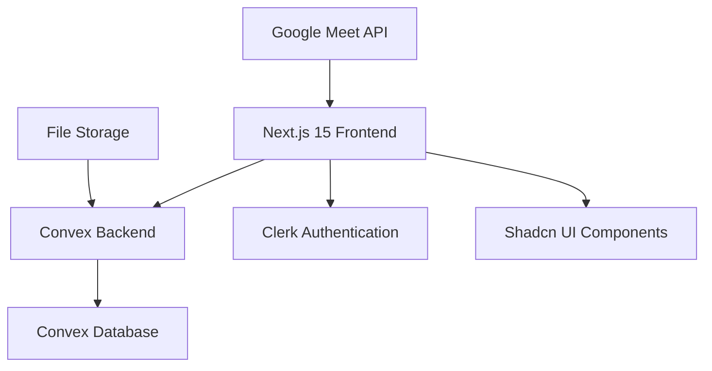

# Design Document

## Overview

The Hanbali Heritage Academy Online Coaching Platform is a Next.js 15 application that provides a streamlined learning management system for Arabic-speaking students. The platform features a student-facing dashboard and an admin management system, built with modern web technologies and optimized for Arabic language support.

### Key Design Principles

- **Arabic-First Design**: All interfaces designed for Arabic text with proper RTL support where needed
- **Dark Theme Aesthetic**: Consistent dark blue color scheme throughout the application
- **Mobile-First Responsive**: Optimized for mobile devices with desktop enhancements
- **Performance-Oriented**: Fast loading times and efficient data management
- **Security-Focused**: Secure authentication and data handling

## Architecture

### High-Level Architecture



### Technology Stack

- **Frontend Framework**: Next.js 15 with App Router
- **UI Components**: Shadcn/ui with Tailwind CSS
- **Backend & Database**: Convex (serverless backend with real-time capabilities)
- **Authentication**: Clerk (to be implemented after UI completion)
- **Styling**: Tailwind CSS with custom dark blue theme
- **File Handling**: Convex file storage for attachments and resources
- **State Management**: React Server Components with Convex real-time subscriptions

### Folder Structure

```
app/
├── (auth)/
│   ├── sign-in/
│   └── sign-up/
├── (student)/
│   ├── dashboard/
│   ├── course/
│   │   └── [courseId]/
│   └── profile/
├── (admin)/
│   ├── dashboard/
│   ├── meetings/
│   ├── schedule/
│   ├── courses/
│   └── news/
├── api/
├── globals.css
├── layout.tsx
└── page.tsx

components/
├── ui/ (shadcn components)
├── student/
├── admin/
└── shared/

convex/
├── schema.ts
├── students.ts
├── courses.ts
├── meetings.ts
├── news.ts
└── auth.ts

lib/
├── utils.ts
├── constants.ts
└── types.ts
```

## Components and Interfaces

### Student Interface Components

#### 1. Student Dashboard Layout
- **Navigation Bar**: Academy logo, title, and profile dropdown
- **Current Lesson Card**: Google Meet link, password, countdown timer
- **Weekly Schedule Grid**: Upcoming lessons with course names and times
- **News Feed**: Announcements and downloadable attachments

#### 2. Course Detail Page
- **Course Header**: Course name, description, instructor info
- **Lesson Archive**: Chronological list of past lessons
- **Resource Library**: Downloadable materials organized by lesson
- **Navigation**: Back to dashboard, related courses

#### 3. Profile Modal
- **Student Information**: Name, enrollment details, progress
- **Settings**: Language preferences, notification settings
- **Sign Out**: Secure session termination

### Admin Interface Components

#### 1. Admin Dashboard
- **Statistics Overview**: Student count, active courses, upcoming sessions
- **Quick Actions**: Create meeting, add announcement, schedule lesson
- **Recent Activity**: Latest student activities and system events

#### 2. Meeting Management
- **Active Meeting Panel**: Current session details and controls
- **Meeting Scheduler**: Create/edit Google Meet sessions
- **Meeting History**: Past sessions with attendance data

#### 3. Schedule Management
- **Weekly Calendar View**: Visual schedule with drag-and-drop editing
- **Lesson Form**: Create/edit lesson details
- **Conflict Detection**: Automatic scheduling conflict warnings

#### 4. Course Management
- **Course List**: All courses with quick edit actions
- **Content Upload**: File upload with progress indicators
- **Resource Organization**: Categorize materials by course and lesson

#### 5. News Management
- **News Editor**: Rich text editor for announcements
- **Attachment Manager**: File upload and organization
- **Publication Scheduler**: Schedule announcements for future release

### Shared Components

#### 1. UI Components (Shadcn-based)
- **Button**: Custom styled with dark theme variants
- **Card**: Content containers with Arabic typography support
- **Modal**: Overlay dialogs with proper focus management
- **Form**: Input components with Arabic validation
- **Navigation**: Responsive navigation with mobile menu

#### 2. Layout Components
- **Header**: Consistent navigation across all pages
- **Sidebar**: Admin navigation with role-based visibility
- **Footer**: Academy information and links
- **Loading**: Skeleton loaders and progress indicators

## Data Models

### Convex Schema Design

```typescript
// Student Model
export const students = defineTable({
  clerkId: v.string(),
  name: v.string(),
  email: v.string(),
  enrollmentDate: v.number(),
  isActive: v.boolean(),
  courses: v.array(v.id("courses")),
}).index("by_clerk_id", ["clerkId"]);

// Course Model
export const courses = defineTable({
  name: v.string(),
  description: v.string(),
  instructor: v.string(),
  isActive: v.boolean(),
  createdAt: v.number(),
  students: v.array(v.id("students")),
}).index("by_active", ["isActive"]);

// Meeting Model
export const meetings = defineTable({
  courseId: v.id("courses"),
  googleMeetLink: v.string(),
  password: v.optional(v.string()),
  scheduledTime: v.number(),
  duration: v.number(),
  isActive: v.boolean(),
  createdBy: v.id("students"),
}).index("by_course", ["courseId"])
  .index("by_scheduled_time", ["scheduledTime"]);

// Lesson Model
export const lessons = defineTable({
  courseId: v.id("courses"),
  meetingId: v.optional(v.id("meetings")),
  title: v.string(),
  description: v.optional(v.string()),
  scheduledTime: v.number(),
  recordingUrl: v.optional(v.string()),
  resources: v.array(v.id("files")),
}).index("by_course", ["courseId"])
  .index("by_scheduled_time", ["scheduledTime"]);

// News Model
export const news = defineTable({
  title: v.string(),
  content: v.string(),
  publishedAt: v.number(),
  isPublished: v.boolean(),
  attachments: v.array(v.id("files")),
  createdBy: v.id("students"),
}).index("by_published", ["isPublished", "publishedAt"]);

// File Model (for Convex file storage)
export const files = defineTable({
  storageId: v.id("_storage"),
  name: v.string(),
  type: v.string(),
  size: v.number(),
  uploadedBy: v.id("students"),
  uploadedAt: v.number(),
}).index("by_uploaded_by", ["uploadedBy"]);
```

### API Endpoints (Convex Functions)

#### Student Functions
- `getStudentDashboard`: Fetch current lesson, schedule, and news
- `getCourseDetails`: Get course information and resources
- `getStudentProfile`: Retrieve student information
- `downloadFile`: Secure file download with access control

#### Admin Functions
- `createMeeting`: Create new Google Meet session
- `updateSchedule`: Manage weekly lesson schedule
- `uploadCourseContent`: Handle file uploads and organization
- `publishNews`: Create and publish announcements
- `getAdminStats`: Dashboard statistics and analytics

#### Shared Functions
- `getCurrentMeeting`: Get active meeting information
- `getWeeklySchedule`: Fetch upcoming lessons
- `getNews`: Retrieve published announcements
- `authenticateUser`: Handle user authentication state

## Error Handling

### Client-Side Error Handling

#### 1. Network Errors
- **Connection Issues**: Display offline indicator and retry mechanisms
- **API Failures**: Show user-friendly error messages with retry options
- **File Upload Errors**: Progress indicators with error recovery

#### 2. Validation Errors
- **Form Validation**: Real-time validation with Arabic error messages
- **File Type Validation**: Clear feedback for unsupported file types
- **Schedule Conflicts**: Visual warnings for scheduling issues

#### 3. Authentication Errors
- **Session Expiry**: Automatic redirect to login with session restoration
- **Permission Denied**: Clear messaging for unauthorized access
- **Account Issues**: Support contact information and troubleshooting

### Server-Side Error Handling

#### 1. Convex Error Handling
- **Database Errors**: Graceful fallbacks and error logging
- **File Storage Errors**: Retry mechanisms and user notification
- **Real-time Sync Issues**: Automatic reconnection and state recovery

#### 2. External API Errors
- **Google Meet API**: Fallback to manual link entry
- **File Processing**: Error recovery and user notification
- **Third-party Services**: Graceful degradation of features

### Error Logging and Monitoring
- **Client Errors**: Browser console logging and optional error reporting
- **Server Errors**: Convex built-in logging and monitoring
- **User Actions**: Audit trail for admin actions and security events

## Testing Strategy

### Unit Testing
- **Component Testing**: React Testing Library for UI components
- **Function Testing**: Convex function testing with mock data
- **Utility Testing**: Jest for helper functions and utilities

### Integration Testing
- **API Integration**: End-to-end testing of Convex functions
- **Authentication Flow**: Clerk integration testing
- **File Upload/Download**: Complete file handling workflows

### User Acceptance Testing
- **Student Workflows**: Dashboard navigation, course access, file downloads
- **Admin Workflows**: Content management, scheduling, user administration
- **Cross-browser Testing**: Modern browser compatibility verification
- **Mobile Testing**: Responsive design and touch interaction testing

### Performance Testing
- **Load Testing**: Multiple concurrent users and file operations
- **Real-time Testing**: Convex subscription performance under load
- **File Handling**: Large file upload and download performance
- **Mobile Performance**: Touch responsiveness and loading times

### Accessibility Testing
- **Arabic Language Support**: RTL text rendering and navigation
- **Keyboard Navigation**: Full keyboard accessibility
- **Screen Reader Support**: ARIA labels and semantic HTML
- **Color Contrast**: Dark theme accessibility compliance

## Security Considerations

### Authentication Security
- **Clerk Integration**: Secure token handling and session management
- **Role-based Access**: Student vs. admin permission enforcement
- **Session Security**: Automatic logout and session validation

### Data Security
- **Input Validation**: Server-side validation for all user inputs
- **File Upload Security**: File type validation and virus scanning
- **SQL Injection Prevention**: Convex built-in query protection
- **XSS Prevention**: Input sanitization and output encoding

### API Security
- **Rate Limiting**: Prevent abuse of API endpoints
- **CORS Configuration**: Proper cross-origin request handling
- **Error Information**: Avoid exposing sensitive system information
- **Audit Logging**: Track admin actions and security events

## Performance Optimization

### Frontend Performance
- **Code Splitting**: Route-based and component-based splitting
- **Image Optimization**: Next.js Image component with proper sizing
- **Caching Strategy**: Browser caching and service worker implementation
- **Bundle Optimization**: Tree shaking and dead code elimination

### Backend Performance
- **Convex Optimization**: Efficient query design and indexing
- **Real-time Efficiency**: Optimized subscription patterns
- **File Storage**: CDN integration for static assets
- **Database Indexing**: Proper indexing for common queries

### Mobile Performance
- **Responsive Images**: Adaptive image loading for mobile devices
- **Touch Optimization**: Proper touch targets and gesture handling
- **Network Efficiency**: Reduced payload sizes and compression
- **Progressive Loading**: Skeleton screens and lazy loading

## Deployment and Infrastructure

### Development Environment
- **Local Development**: Next.js dev server with Convex local backend
- **Environment Variables**: Secure configuration management
- **Hot Reloading**: Fast development iteration with Turbopack

### Production Deployment
- **Vercel Hosting**: Optimized Next.js deployment platform
- **Convex Production**: Managed backend with automatic scaling
- **CDN Integration**: Global content delivery for static assets
- **SSL/TLS**: Secure HTTPS communication

### Monitoring and Analytics
- **Performance Monitoring**: Real-time application performance tracking
- **Error Tracking**: Automatic error detection and reporting
- **Usage Analytics**: User behavior and feature usage insights
- **Uptime Monitoring**: Service availability and response time tracking