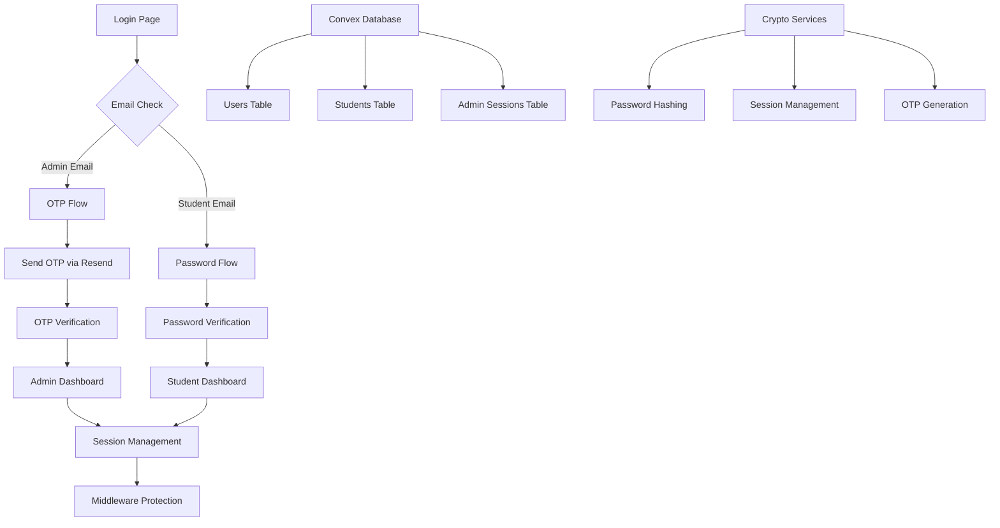

# Design Document

## Overview

This design implements a complete authentication system overhaul using modern Next.js patterns, secure cryptographic practices following The Copenhagen Book guidelines, and Convex as the backend database. The system eliminates the current complexity while providing secure, reliable authentication for both admin and student users.

## Architecture

### High-Level Architecture



### Authentication Flow

1. **Unified Login Entry**: Single login page that determines user type based on email
2. **Admin Flow**: Email → OTP generation → Email delivery → OTP verification → Session creation
3. **Student Flow**: Email → Password prompt → Password verification → Session creation
4. **Session Management**: JWT tokens with role-based expiration and middleware protection

## Components and Interfaces

### Core Services

#### 1. Authentication Service (`lib/auth-service.ts`)

```typescript
interface AuthService {
  // Admin authentication
  sendAdminOTP(email: string): Promise<AuthResult<void>>
  verifyAdminOTP(email: string, otp: string): Promise<AuthResult<SessionData>>
  
  // Student authentication
  authenticateStudent(email: string, password: string): Promise<AuthResult<SessionData>>
  
  // Session management
  createSession(user: UserData): Promise<AuthResult<string>>
  validateSession(token: string): Promise<AuthResult<SessionData>>
  refreshSession(token: string): Promise<AuthResult<string>>
  revokeSession(token: string): Promise<AuthResult<void>>
}
```

#### 2. Cryptographic Services (`lib/crypto-service.ts`)

```typescript
interface CryptoService {
  // Password operations (following Copenhagen Book guidelines)
  hashPassword(password: string): Promise<string>
  verifyPassword(password: string, hash: string): Promise<boolean>
  
  // OTP operations
  generateOTP(): string
  verifyOTP(provided: string, expected: string): boolean
  
  // Session operations
  createSessionToken(payload: SessionPayload): Promise<string>
  verifySessionToken(token: string): Promise<SessionPayload | null>
}
```

#### 3. Email Service (`lib/email-service.ts`)

```typescript
interface EmailService {
  sendAdminOTP(email: string, otp: string): Promise<boolean>
  sendStudentInvitation(email: string, tempPassword: string): Promise<boolean>
}
```

### Server Actions

#### 1. Authentication Actions (`app/actions/auth-actions.ts`)

```typescript
// Admin authentication
export async function sendOTPAction(email: string): Promise<ActionResult>
export async function verifyOTPAction(email: string, otp: string): Promise<ActionResult>

// Student authentication  
export async function authenticateStudentAction(email: string, password: string): Promise<ActionResult>

// Session management
export async function logoutAction(): Promise<ActionResult>
```

#### 2. Admin Actions (`app/actions/admin-actions.ts`)

```typescript
// Student management
export async function createStudentAction(data: CreateStudentData): Promise<ActionResult>
export async function updateStudentStatusAction(id: string, active: boolean): Promise<ActionResult>
export async function resetStudentPasswordAction(id: string): Promise<ActionResult>
```

### Convex Schema Updates

#### Enhanced Schema (`convex/schema.ts`)

```typescript
// Users table (unified authentication)
users: defineTable({
  email: v.string(),
  passwordHash: v.optional(v.string()), // Only for students
  role: v.union(v.literal("admin"), v.literal("student")),
  isActive: v.boolean(),
  createdAt: v.number(),
  updatedAt: v.number(),
})
.index("by_email", ["email"])
.index("by_role", ["role"]),

// Students table (profile data)
students: defineTable({
  userId: v.id("users"),
  name: v.string(),
  courses: v.array(v.id("courses")),
  enrollmentDate: v.number(),
  lastLoginAt: v.optional(v.number()),
  requiresPasswordChange: v.boolean(),
})
.index("by_user_id", ["userId"]),

// Admin OTP table (temporary OTP storage)
adminOTPs: defineTable({
  email: v.string(),
  otp: v.string(),
  expiresAt: v.number(),
  attempts: v.number(),
  createdAt: v.number(),
})
.index("by_email", ["email"])
.index("by_expires_at", ["expiresAt"]),

// Admin sessions (for additional security tracking)
adminSessions: defineTable({
  email: v.string(),
  sessionId: v.string(),
  expiresAt: v.number(),
  createdAt: v.number(),
  lastAccessAt: v.number(),
})
.index("by_email", ["email"])
.index("by_session_id", ["sessionId"])
.index("by_expires_at", ["expiresAt"]),
```

### UI Components

#### 1. Unified Login Component (`app/login/page.tsx`)

- Single-step email entry
- Dynamic flow determination (admin vs student)
- Clean error handling with toast notifications
- Proper loading states
- Accessibility compliance

#### 2. OTP Input Component (`components/auth/otp-input.tsx`)

- 6-digit OTP input with auto-focus
- Paste support for OTP codes
- Clear visual feedback
- Resend functionality with cooldown

#### 3. Password Input Component (`components/auth/password-input.tsx`)

- Secure password input with visibility toggle
- Strength indicator for password changes
- Auto-complete attributes for better UX

## Data Models

### User Authentication Model

```typescript
interface User {
  id: string
  email: string
  role: 'admin' | 'student'
  isActive: boolean
  createdAt: number
  updatedAt: number
  passwordHash?: string // Only for students
}

interface Student {
  id: string
  userId: string
  name: string
  courses: string[]
  enrollmentDate: number
  lastLoginAt?: number
  requiresPasswordChange: boolean
}

interface AdminOTP {
  email: string
  otp: string
  expiresAt: number
  attempts: number
  createdAt: number
}

interface SessionData {
  userId: string
  email: string
  role: 'admin' | 'student'
  expiresAt: number
  createdAt: number
}
```

### Configuration Model

```typescript
interface AuthConfig {
  // Admin emails (hardcoded)
  adminEmails: string[]
  
  // Session durations
  adminSessionDuration: string // '24h'
  studentSessionDuration: string // '7d'
  
  // OTP settings
  otpLength: number // 6
  otpExpiryMinutes: number // 15
  maxOtpAttempts: number // 3
  
  // Rate limiting
  maxOtpRequestsPerHour: number // 3
  
  // Security
  jwtSecret: string
  cookieSettings: CookieOptions
}
```

## Error Handling

### Error Types and Responses

```typescript
enum AuthErrorCode {
  INVALID_CREDENTIALS = 'INVALID_CREDENTIALS',
  ACCOUNT_INACTIVE = 'ACCOUNT_INACTIVE',
  OTP_EXPIRED = 'OTP_EXPIRED',
  OTP_INVALID = 'OTP_INVALID',
  EMAIL_SEND_FAILED = 'EMAIL_SEND_FAILED',
  SESSION_EXPIRED = 'SESSION_EXPIRED',
  RATE_LIMITED = 'RATE_LIMITED',
  UNAUTHORIZED = 'UNAUTHORIZED'
}

interface AuthError {
  code: AuthErrorCode
  message: string
  messageAr: string
  details?: Record<string, any>
}

interface ActionResult<T = any> {
  success: boolean
  data?: T
  error?: AuthError
}
```

### Error Display Strategy

1. **User-Facing Errors**: Simple, non-technical messages in Arabic
2. **Developer Logs**: Detailed error information in English
3. **Toast Notifications**: Single error display with dismiss functionality
4. **No Information Leakage**: Never reveal whether email exists or which credential failed

## Testing Strategy

### Unit Tests

1. **Oslo.js Service Tests**
   - Password hashing and verification
   - OTP generation and validation
   - JWT creation and verification

2. **Authentication Logic Tests**
   - Admin email validation
   - Student credential verification
   - Session management

3. **Server Action Tests**
   - Input validation
   - Error handling
   - Success flows

### Integration Tests

1. **Authentication Flows**
   - Complete admin login flow
   - Complete student login flow
   - Session validation and refresh

2. **Email Service Tests**
   - OTP delivery (mocked in tests)
   - Error handling for email failures

3. **Database Integration**
   - User creation and retrieval
   - Session storage and cleanup
   - OTP storage and expiration

### End-to-End Tests

1. **User Journey Tests**
   - Admin login with OTP
   - Student login with password
   - Session expiration handling
   - Logout functionality

2. **Security Tests**
   - Rate limiting validation
   - Session hijacking prevention
   - Password security requirements

## Security Considerations

### Password Security

- **Argon2id Hashing**: Following The Copenhagen Book recommendations for secure password hashing
- **Salt Generation**: Cryptographically secure random salts per password
- **Password Requirements**: Minimum 8 characters, complexity requirements
- **Legacy Migration**: Automatic detection and migration of bcrypt hashes to Argon2id

### Session Security

- **JWT Signing**: HS256 with secure secret key
- **Cookie Security**: HTTP-only, Secure, SameSite=Strict
- **Session Expiration**: Role-based expiration times
- **Token Refresh**: Automatic refresh before expiration

### OTP Security

- **Cryptographic Generation**: Secure random number generation
- **Time-based Expiration**: 15-minute validity window
- **Attempt Limiting**: Maximum 3 verification attempts
- **Rate Limiting**: Maximum 3 OTP requests per hour per email

### Input Validation

- **Email Validation**: RFC-compliant email format validation
- **Password Validation**: Strength requirements and length limits
- **OTP Validation**: Numeric format and length validation
- **SQL Injection Prevention**: Parameterized queries through Convex

## Performance Considerations

### Optimization Strategies

1. **Database Queries**
   - Indexed lookups for email and user ID
   - Efficient session validation queries
   - Automatic cleanup of expired data

2. **Caching**
   - Admin email list caching
   - Session data caching in memory
   - OTP validation result caching

3. **Email Delivery**
   - Asynchronous email sending
   - Retry logic for failed deliveries
   - Connection pooling for Resend API

### Monitoring and Logging

1. **Authentication Metrics**
   - Login success/failure rates
   - OTP delivery success rates
   - Session duration analytics

2. **Security Monitoring**
   - Failed login attempt tracking
   - Rate limiting trigger monitoring
   - Suspicious activity detection

3. **Performance Monitoring**
   - Authentication response times
   - Database query performance
   - Email delivery latency

## Migration Strategy

### Phase 1: Core Infrastructure
- Implement secure cryptographic services following The Copenhagen Book
- Update Convex schema
- Create new authentication actions

### Phase 2: Authentication Flows
- Implement admin OTP flow
- Implement student password flow
- Add session management

### Phase 3: UI Updates
- Update login page
- Add proper error handling
- Implement loading states

### Phase 4: Testing and Deployment
- Comprehensive testing
- Security audit
- Gradual rollout with monitoring

## Configuration Management

### Environment Variables

```bash
# JWT Configuration
JWT_SECRET=your-secure-jwt-secret-key

# Email Service
RESEND_API_KEY=your-resend-api-key

# Application URLs
NEXT_PUBLIC_APP_URL=https://your-domain.com

# Development Settings
NODE_ENV=development|production
```

### Admin Configuration

```typescript
// Hardcoded admin emails (to be updated in code)
const ADMIN_EMAILS = [
  'medalikhaled331@gmail.com',
  // Add more admin emails here
]
```

This design provides a clean, secure, and maintainable authentication system that addresses all the issues in the current implementation while following modern Next.js best practices.