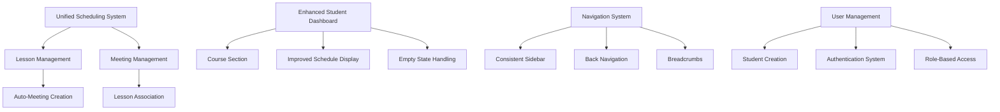

# Design Document

## Overview

This design addresses critical improvements to the scheduling system, student dashboard, navigation consistency, and user management. The solution focuses on creating a unified, logical, and user-friendly experience while implementing proper validation and authentication systems.

## Architecture

### Current System Analysis

Based on the codebase analysis, the current system has several architectural issues:

1. **Separate Lesson and Meeting Systems**: Lessons and meetings are managed independently with no logical connection
2. **No Past Date Validation**: The scheduling system allows past dates without validation
3. **Missing Course Display**: Student dashboard lacks dedicated course section
4. **Inconsistent Navigation**: Admin routes lack proper back navigation and sidebar consistency
5. **Hardcoded Authentication**: Only admin users exist, no student creation system

### Proposed Architecture Improvements



## Components and Interfaces

### 1. Schedule Validation System

#### Date Validation Component
```typescript
interface DateValidationResult {
  isValid: boolean
  error?: string
  warning?: string
}

interface ScheduleValidator {
  validateDate(date: Date): DateValidationResult
  validateTimeConflicts(dateTime: Date, existingLessons: Lesson[]): DateValidationResult
  validateWeeklyDisplay(lessons: Lesson[], currentWeek: Date): Lesson[]
}
```

#### Enhanced Lesson Form
- Add past date validation with clear error messages
- Implement real-time date validation
- Show warnings for scheduling conflicts
- Prevent form submission for invalid dates

### 2. Unified Lesson-Meeting System

#### Unified Scheduling Interface
```typescript
interface UnifiedScheduleEvent {
  id: string
  type: 'lesson' | 'meeting' | 'lesson-with-meeting'
  lessonDetails?: LessonDetails
  meetingDetails?: MeetingDetails
  courseId: string
  scheduledTime: number
  duration: number
}

interface UnifiedSchedulingForm {
  eventType: 'lesson' | 'meeting' | 'both'
  autoCreateMeeting: boolean
  lessonData: LessonFormData
  meetingData: MeetingFormData
}
```

#### Implementation Strategy
- Modify lesson creation to optionally auto-create meetings
- Add toggle in lesson form for meeting creation
- Unify the scheduling interface with tabs or sections
- Maintain backward compatibility with existing data

### 3. Enhanced Student Dashboard

#### Course Display Section
```typescript
interface CourseDisplayProps {
  courses: Course[]
  onCourseClick: (courseId: string) => void
  isEmpty: boolean
}

interface CourseCard {
  course: Course
  nextLesson?: Lesson
  upcomingMeetings: Meeting[]
  progressInfo: CourseProgress
}
```

#### Dashboard Layout Improvements
- Add dedicated "My Courses" section
- Display course cards with next lesson info
- Implement course navigation to individual pages
- Add proper empty states for all sections

### 4. Navigation Consistency System

#### Enhanced Admin Layout
```typescript
interface AdminLayoutProps {
  children: React.ReactNode
  currentPage: string
  showBackButton?: boolean
  backUrl?: string
  breadcrumbs?: BreadcrumbItem[]
  sidebarCollapsible?: boolean
}

interface BreadcrumbItem {
  label: string
  href?: string
  isActive?: boolean
}
```

#### Navigation Features
- Always-visible collapsible sidebar
- Breadcrumb navigation for sub-routes
- Back button for deep navigation
- Responsive mobile navigation
- Consistent header across all admin pages

### 5. Student User Management System

#### Student Creation Interface
```typescript
interface StudentCreationForm {
  personalInfo: {
    name: string
    email: string
    phone?: string
  }
  courseAssignments: string[]
  authenticationMethod: 'email-invitation' | 'manual-credentials'
  initialPassword?: string
}

interface StudentManagement {
  createStudent: (data: StudentCreationForm) => Promise<Student>
  updateStudent: (id: string, data: Partial<StudentCreationForm>) => Promise<Student>
  deleteStudent: (id: string) => Promise<void>
  sendInvitation: (studentId: string) => Promise<void>
}
```

## Data Models

### Enhanced Lesson Model
```typescript
interface Lesson {
  _id: Id<"lessons">
  courseId: Id<"courses">
  title: string
  description?: string
  scheduledTime: number
  recordingUrl?: string
  resources: Id<"files">[]
  meetingId?: Id<"meetings"> // Auto-created meeting
  autoMeetingEnabled: boolean
  createdAt: number
  updatedAt: number
}
```

### Enhanced Meeting Model
```typescript
interface Meeting {
  _id: Id<"meetings">
  courseId: Id<"courses">
  lessonId?: Id<"lessons"> // Associated lesson
  googleMeetLink: string
  password?: string
  scheduledTime: number
  duration: number
  isActive: boolean
  createdAt: number
  updatedAt: number
}
```

### Student User Model
```typescript
interface Student {
  _id: Id<"students">
  userId: Id<"users"> // Link to auth system
  name: string
  email: string
  phone?: string
  courses: Id<"courses">[]
  isActive: boolean
  invitationSent: boolean
  lastLogin?: number
  createdAt: number
  updatedAt: number
}

interface User {
  _id: Id<"users">
  email: string
  passwordHash: string
  role: 'admin' | 'student'
  isActive: boolean
  createdAt: number
}
```

## Error Handling

### Validation Error System
```typescript
interface ValidationError {
  field: string
  message: string
  type: 'error' | 'warning'
}

interface FormValidationResult {
  isValid: boolean
  errors: ValidationError[]
  warnings: ValidationError[]
}
```

### Error Handling Strategies
1. **Past Date Prevention**: Block form submission with clear error messages
2. **Conflict Warnings**: Show warnings for scheduling conflicts but allow override
3. **Network Error Recovery**: Implement retry mechanisms for failed requests
4. **Graceful Degradation**: Show partial data when some queries fail
5. **User Feedback**: Clear success/error messages for all operations

## Testing Strategy

### Unit Testing Focus Areas
1. **Date Validation Logic**: Test past date detection and validation rules
2. **Schedule Conflict Detection**: Test time overlap calculations
3. **Form Validation**: Test all form validation scenarios
4. **Navigation Logic**: Test breadcrumb generation and back navigation
5. **User Creation Flow**: Test student creation and invitation process

### Integration Testing
1. **Unified Scheduling Flow**: Test lesson creation with auto-meeting generation
2. **Dashboard Data Loading**: Test dashboard with various data states
3. **Navigation Consistency**: Test navigation across all admin routes
4. **Authentication Flow**: Test student login and role-based access

### User Experience Testing
1. **Schedule Validation UX**: Test user experience with validation errors
2. **Empty State Handling**: Test dashboard with no data scenarios
3. **Mobile Navigation**: Test responsive navigation on various screen sizes
4. **Course Navigation**: Test student course access and navigation

## Implementation Phases

### Phase 1: Schedule Validation and Display Fixes
- Implement past date validation in lesson form
- Fix weekly schedule display for current week lessons
- Add proper error handling and user feedback

### Phase 2: Student Dashboard Course Section
- Add course display section to student dashboard
- Implement course card components
- Add navigation to individual course pages
- Implement proper empty states

### Phase 3: Unified Lesson-Meeting System
- Modify lesson creation to optionally create meetings
- Add unified scheduling interface
- Maintain backward compatibility
- Update existing data relationships

### Phase 4: Navigation Consistency
- Implement collapsible sidebar system
- Add breadcrumb navigation
- Add back buttons to sub-routes
- Ensure responsive mobile navigation

### Phase 5: Student User Management
- Create student management interface
- Implement user creation and authentication
- Add invitation system
- Implement role-based dashboard access

## Security Considerations

### Authentication Security
- Secure password hashing for student accounts
- Email verification for new student accounts
- Session management and timeout handling
- Role-based access control enforcement

### Data Validation Security
- Server-side validation for all form inputs
- SQL injection prevention in database queries
- XSS prevention in user-generated content
- CSRF protection for form submissions

### Access Control
- Proper authorization checks for admin functions
- Student data isolation (students see only their data)
- Secure API endpoints with proper authentication
- Audit logging for sensitive operations